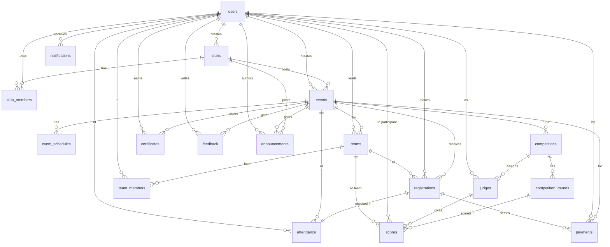

# Database

CampusConnect uses **MySQL 8**. The schema is defined by JPA/Hibernate entities and
created automatically at startup (`JPA_DDL_AUTO=update`). This document describes the
tables, enums and relationships so you can reason about the data without reading the
entity classes.

- [How the schema is managed](#how-the-schema-is-managed)
- [Entity–relationship diagram](#entityrelationship-diagram)
- [Tables](#tables)
- [Enumerations](#enumerations)
- [Seed data](#seed-data)
- [Production guidance](#production-guidance)

---

## How the schema is managed

Every entity extends a common `BaseEntity` that provides:

- `id` — `BIGINT` auto-increment primary key.
- `created_at` — set once on insert (JPA auditing).
- `updated_at` — refreshed on every update.

Hibernate maps Java camelCase fields to snake_case columns, and enums are stored as
strings (`@Enumerated(EnumType.STRING)`) so values are human-readable in the database.
With `JPA_DDL_AUTO=update`, Hibernate reconciles the schema on boot — convenient for
development. For production, prefer `validate` plus a migration tool (see
[Production guidance](#production-guidance)).

## Entity–relationship diagram

## Tables

| Table | Purpose | Key relationships |
| --- | --- | --- |
| `users` | Accounts (student / club member / coordinator). | referenced by nearly everything |
| `clubs` | Clubs that host events. | `created_by` → users |
| `club_members` | Membership + role (member/coordinator) + status. | → clubs, → users |
| `events` | Events hosted by a club. | → clubs, `created_by` → users |
| `event_schedules` | Agenda/sessions within an event. | → events |
| `registrations` | A user's registration for an event (individual or team). | → events, → users, → teams (nullable) |
| `teams` | Teams for team events. | → events, `leader` → users |
| `team_members` | Members of a team. | → teams, → users |
| `attendance` | Check-in/out records (QR or manual). | 1–1 → registrations, → events, → users, `marked_by` → users |
| `competitions` | A competition run under an event. | → events |
| `competition_rounds` | Rounds within a competition. | → competitions |
| `judges` | Users assigned to judge a competition. | → competitions, → users |
| `scores` | A judge's score for a participant/team in a round. | → competition_rounds, → judges, → users (nullable), → teams (nullable) |
| `certificates` | Issued certificates with a verification code. | → users, → events |
| `payments` | Payment records for paid events. | → users, → events, → registrations (nullable) |
| `feedback` | Ratings/comments on events. | → events, → users |
| `announcements` | Club / event / general announcements. | → clubs (nullable), → events (nullable), `author` → users |
| `notifications` | Per-user notifications. | `recipient` → users |
| `media` | Uploaded media references. | polymorphic references |
| `volunteers` | Volunteers for an event. | → events, → users |
| `volunteer_tasks` | Tasks assigned to volunteers. | → volunteers |

Notable constraints:

- `users.email` is **unique**.
- `attendance.registration` is a **one-to-one** — a registration is checked in at
  most once.
- A `score` targets **either** a `team` (team-based competition) **or** a
  `participant` user (individual) — never both.

## Enumerations

Stored as strings.

| Enum | Values |
| --- | --- |
| `Role` | `STUDENT`, `CLUB_MEMBER`, `CLUB_COORDINATOR` |
| `ClubRole` | `MEMBER`, `COORDINATOR` |
| `MembershipStatus` | `PENDING`, `ACTIVE`, `REJECTED`, `LEFT` |
| `EventMode` | `ONLINE`, `OFFLINE`, `HYBRID` |
| `EventStatus` | `DRAFT`, `PUBLISHED`, `UPCOMING`, `ONGOING`, `COMPLETED`, `CANCELLED` |
| `RegistrationType` | `INDIVIDUAL`, `TEAM` |
| `RegistrationStatus` | `REGISTERED`, `CONFIRMED`, `WAITLISTED`, `CANCELLED` |
| `AttendanceMethod` | `QR`, `MANUAL` |
| `CompetitionStatus` | `DRAFT`, `ONGOING`, `COMPLETED`, `CANCELLED` |
| `CertificateType` | `PARTICIPATION`, `WINNER`, `MERIT` |
| `PaymentStatus` | `PENDING`, `SUCCESS`, `FAILED`, `REFUNDED` |
| `AnnouncementScope` | `CLUB`, `EVENT`, `GENERAL` |
| `NotificationType` | `REGISTRATION_CONFIRMATION`, `EVENT_REMINDER`, `SCHEDULE_UPDATE`, `EVENT_CANCELLED`, `ANNOUNCEMENT`, `CERTIFICATE_ISSUED`, `PAYMENT_UPDATE`, `GENERAL` |
| `TaskStatus` | `PENDING`, `IN_PROGRESS`, `COMPLETED` |

## Seed data

On first startup with an empty `users` table (and `SEED_ENABLED=true`), a
`DataSeeder` populates realistic demo data: 5 users (1 coordinator, 1 club member,
3 students), 3 clubs, and 5 events, all sharing the password `Password123!`. See the
[README](../README.md#demo-accounts) for the login emails. Seeding is skipped as soon
as any user exists, so it never overwrites real data.

## Production guidance

- Set `JPA_DDL_AUTO=validate` and manage schema changes with a migration tool
  (e.g. Flyway or Liquibase) so changes are reviewed and reversible.
- Set `SEED_ENABLED=false`.
- Use a dedicated MySQL user with only the privileges the app needs (not `root`).
- Back up the `mysql-data` volume (Docker) or your managed database regularly.
- Use `utf8mb4` (the default here) to store the full range of Unicode, including
  emoji, in names and descriptions.
